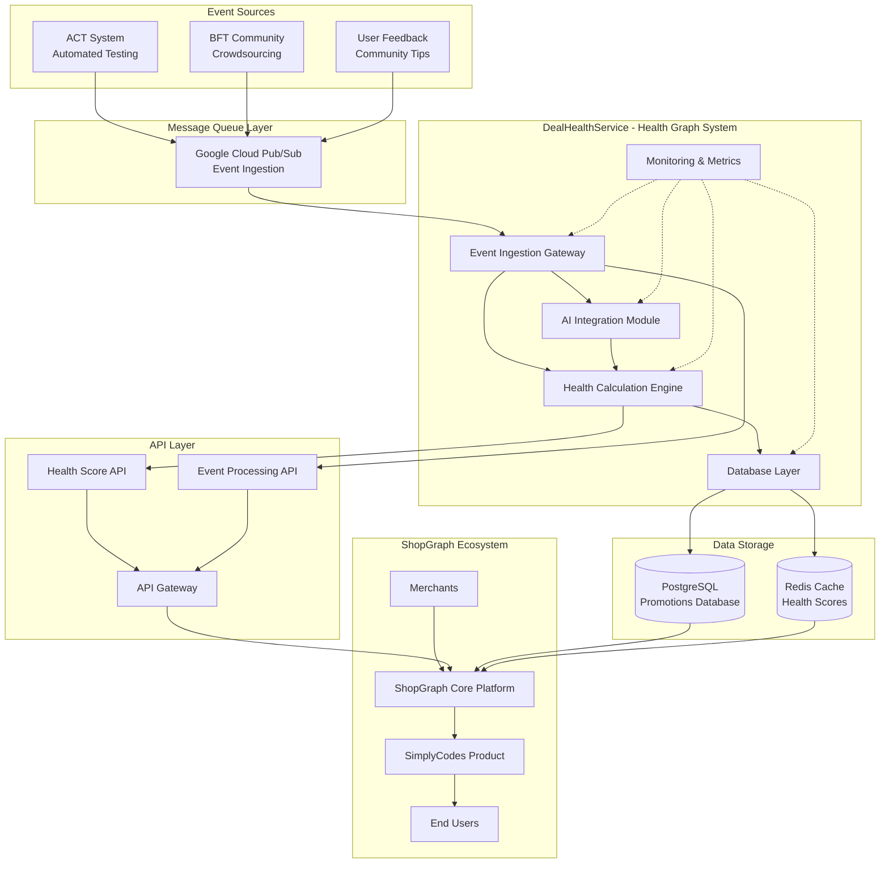

# DealHealthService System Design

## Overview

The DealHealthService is a microservice designed to process verification events from multiple sources and calculate real-time health scores for promotions in ShopGraph. This service ensures the accuracy and reliability of promotional data, directly impacting user trust and the success of products like SimplyCodes.

## Problem Statement

ShopGraph needs a reliable system to validate and score promotional offers to ensure users can trust the deals they find. The system must:

1. Process events from multiple sources (automated testing, community verification, user feedback)
2. Calculate real-time health scores that reflect current promotion status
3. Handle 50x traffic spikes during flash sales
4. Provide confidence scores and explanations for health calculations
5. Integrate with AI for processing natural language community tips

## System Architecture

### High-Level Architecture



## Component Design

### 1. Event Ingestion Gateway

**Purpose**: Entry point for all verification events from the ShopGraph ecosystem.

**Responsibilities**:
- Consume events from Google Cloud Pub/Sub
- Validate event schemas and data integrity
- Route events to appropriate processing modules
- Implement retry logic and dead letter queues
- Ensure at-least-once processing guarantees

**Key Features**:
- Event validation and sanitization
- Automatic retry with exponential backoff
- Dead letter queue for failed events
- Event deduplication and ordering
- Real-time event processing metrics

### 2. Health Calculation Engine

**Purpose**: Core business logic for calculating promotion health scores in the Health Graph System.

**Responsibilities**:
- Weight different event types based on reliability
- Apply temporal decay to older events
- Handle conflicting signals intelligently
- Calculate confidence scores
- Generate health score explanations

**Algorithm**:
```python
def calculate_health_score(events: List[Event]) -> int:
    total_weight = 0
    weighted_sum = 0
    
    for event in events:
        weight = get_event_weight(event)
        decay = calculate_temporal_decay(event.age_hours)
        adjusted_weight = weight * decay
        
        if event.is_positive():
            weighted_sum += adjusted_weight
        else:
            weighted_sum -= adjusted_weight
            
        total_weight += adjusted_weight
    
    if total_weight == 0:
        return 50  # Neutral score
    
    raw_score = (weighted_sum / total_weight + 1) * 50
    return max(0, min(100, int(raw_score)))
```

**Event Weighting**:
- AutomatedTestResult: 0.6 (highest reliability)
- CommunityVerification: 0.3 (weighted by user reputation)
- CommunityTip: 0.1 (weighted by AI confidence and user reputation)

### 3. AI Integration Module

**Purpose**: Process natural language community tips using LLM integration.

**Responsibilities**:
- Extract structured information from unstructured text
- Convert community feedback into actionable signals
- Provide confidence scoring for AI outputs
- Handle fallback processing when AI fails

**LLM Prompt Design**:
```
Analyze the following community tip about a promotion and extract structured information:

Tip: "{tip_text}"

Extract the following information in JSON format:
1. conditions: List of conditions that must be met
2. exclusions: List of exclusions or limitations
3. effectiveness: How well the tip suggests the promotion works (1-10)
4. confidence: Your confidence in this analysis (1-10)

Return only valid JSON.
```

### 4. Database Layer

**Purpose**: Manage promotion state and event processing results with audit trails.

**Responsibilities**:
- Store promotion health scores and metadata
- Maintain event processing audit trails
- Implement optimistic locking for consistency
- Provide caching layer for high-frequency reads

**Schema Design**:
```sql
-- Promotions table with health scoring fields
CREATE TABLE promotions (
    id VARCHAR(255) PRIMARY KEY,
    merchant_id INTEGER NOT NULL,
    title VARCHAR(500) NOT NULL,
    code VARCHAR(100),
    health_score INTEGER DEFAULT 50 CHECK (health_score >= 0 AND health_score <= 100),
    raw_verification_signals JSONB DEFAULT '[]',
    last_verified_at TIMESTAMP,
    last_verification_source VARCHAR(100),
    created_at TIMESTAMP DEFAULT CURRENT_TIMESTAMP,
    updated_at TIMESTAMP DEFAULT CURRENT_TIMESTAMP,
    
    -- Additional fields for health calculation
    total_verifications INTEGER DEFAULT 0,
    successful_verifications INTEGER DEFAULT 0,
    last_automated_test_at TIMESTAMP,
    last_community_verification_at TIMESTAMP,
    confidence_score DECIMAL(5,2) DEFAULT 0.0,
    
    INDEX idx_merchant_id (merchant_id),
    INDEX idx_health_score (health_score),
    INDEX idx_last_verified_at (last_verified_at)
);

-- Event processing audit trail
CREATE TABLE verification_events (
    id SERIAL PRIMARY KEY,
    promotion_id VARCHAR(255) NOT NULL,
    event_type VARCHAR(50) NOT NULL,
    event_data JSONB NOT NULL,
    processed_at TIMESTAMP DEFAULT CURRENT_TIMESTAMP,
    health_score_before INTEGER,
    health_score_after INTEGER,
    
    INDEX idx_promotion_id (promotion_id),
    INDEX idx_event_type (event_type),
    INDEX idx_processed_at (processed_at)
);
```

### 5. Monitoring System

**Purpose**: Comprehensive observability and health monitoring for the Health Graph System.

**Responsibilities**:
- Collect Prometheus metrics
- Provide structured logging with correlation IDs
- Implement distributed tracing
- Monitor service health and performance

**Key Metrics**:
- Event processing rates and latencies
- Health score calculation accuracy
- AI processing success rates
- Database performance metrics
- Queue depth and processing rates

## Data Models

### Event Schemas

#### AutomatedTestResult
```json
{
  "type": "AutomatedTestResult",
  "promotionId": "string",
  "merchantId": "integer",
  "success": "boolean",
  "discountValue": "decimal",
  "timestamp": "datetime",
  "testDuration": "integer",
  "errorMessage": "string?",
  "testEnvironment": "string"
}
```

#### CommunityVerification
```json
{
  "type": "CommunityVerification",
  "promotionId": "string",
  "verifierId": "string",
  "verifierReputationScore": "integer (0-100)",
  "is_valid": "boolean",
  "timestamp": "datetime",
  "verificationMethod": "string",
  "notes": "string?"
}
```

#### CommunityTip
```json
{
  "type": "CommunityTip",
  "promotionId": "string",
  "tipText": "string",
  "timestamp": "datetime",
  "userId": "string?",
  "userReputation": "integer (0-100)?"
}
```

## API Design

### RESTful Endpoints

#### Health & Status
- `GET /health` - Comprehensive health check with component status
- `GET /metrics` - Prometheus metrics for monitoring
- `GET /queue/stats` - Message queue statistics

#### Event Processing
- `POST /events/process` - Process multiple events for a promotion
- `POST /events/process-single` - Process a single event
- `POST /events/batch-process` - Process events for multiple promotions

#### Promotion Queries
- `GET /promotions/{promotion_id}/health` - Get current health score
- `GET /promotions/{promotion_id}/history` - Get health score history
- `GET /merchants/{merchant_id}/promotions` - Get all promotions for a merchant
- `GET /promotions/by-health` - Get promotions by health score range

#### Configuration
- `POST /config/update` - Update Health Graph System configuration

### Response Models

```python
class HealthScoreResponse(BaseModel):
    success: bool
    data: Optional[HealthScoreUpdate] = None
    error: Optional[str] = None

class PromotionHealthResponse(BaseModel):
    success: bool
    data: Optional[PromotionState] = None
    error: Optional[str] = None
```

## Scalability Design

### Flash Sale Scenario (50x Traffic Spike)

**Auto-Scaling Strategy**:
1. **Horizontal Scaling**: Multiple service instances behind load balancer
2. **Queue-Based Scaling**: Scale based on Pub/Sub queue depth
3. **Database Connection Pooling**: Efficient connection management
4. **Read Replicas**: Distribute read load across multiple database instances

**Performance Optimizations**:
1. **Event Batching**: Process multiple events in single database transaction
2. **Caching Layer**: Redis cache for frequently accessed health scores
3. **Async Processing**: Non-blocking event processing with asyncio
4. **Database Indexing**: Optimized indexes for health score queries

**Monitoring & Alerting**:
1. **Queue Depth Monitoring**: Alert when queue depth exceeds thresholds
2. **Processing Latency**: Track end-to-end event processing time
3. **Error Rates**: Monitor failed event processing rates
4. **Health Score Volatility**: Alert on rapid health score changes

## Resilience & Consistency

### At-Least-Once Processing
1. **Message Queue**: Google Cloud Pub/Sub provides at-least-once delivery
2. **Idempotency**: Event processing is idempotent based on event ID and timestamp
3. **Dead Letter Queue**: Failed events sent to DLQ for manual review
4. **Retry Logic**: Exponential backoff with jitter for transient failures

### Eventual Consistency
1. **Optimistic Locking**: Use version numbers to prevent concurrent updates
2. **Event Sourcing**: Store all events for audit trail and replay capability
3. **Caching Strategy**: Redis cache with TTL for high-frequency reads
4. **Database Transactions**: Ensure atomic updates to promotion state

## Technology Stack

### Language/Framework: Python + FastAPI
**Rationale**:
- **Performance**: FastAPI provides near-native performance with async/await support
- **Type Safety**: Built-in Pydantic models ensure data validation and type safety
- **AI Integration**: Rich ecosystem for AI/ML libraries (transformers, openai, etc.)
- **Production Ready**: Automatic OpenAPI docs, built-in testing support
- **Team Expertise**: Python is widely used in data science and AI teams

### Message Queue: Google Cloud Pub/Sub
**Rationale**:
- **Scalability**: Handles 50x traffic spikes during flash sales
- **Reliability**: At-least-once delivery with automatic retries
- **Integration**: Native integration with Google Cloud services
- **Cost Effective**: Pay-per-use model for variable workloads

### Database: PostgreSQL
**Rationale**:
- **JSONB Support**: Native support for storing raw verification signals
- **ACID Compliance**: Ensures data consistency for critical promotion data
- **Performance**: Excellent read/write performance with proper indexing
- **Ecosystem**: Seamless integration with existing ShopGraph infrastructure

## Business Impact

### User Trust Enhancement
- **Real-time Accuracy**: Users see current, reliable promotion health scores
- **Transparent Verification**: Multiple verification sources build confidence
- **Reduced Failed Attempts**: Lower health scores prevent user frustration

### Product Success Metrics
- **SimplyCodes Conversion**: Higher conversion rates with accurate health scores
- **User Retention**: Reduced churn due to reliable promotion data
- **Merchant Satisfaction**: Accurate promotion representation builds trust

### Competitive Advantage
- **Data Accuracy**: Verifiable accuracy as core competitive moat
- **Real-time Updates**: Dynamic health scoring vs. static verification
- **AI Integration**: Intelligent processing of unstructured feedback

## Integration with ShopGraph

### Health Graph System Role
The DealHealthService serves as the **Health Graph System** within ShopGraph, providing:

1. **Real-time Health Scores**: Dynamic scoring that reflects current promotion status
2. **Multi-Source Verification**: Combines automated, community, and AI-powered verification
3. **User Trust Building**: Ensures users can rely on promotional offers
4. **Merchant Transparency**: Provides accurate representation of promotion effectiveness

### Data Flow
1. **Event Sources** → **Pub/Sub** → **DealHealthService**
2. **DealHealthService** → **Health Score Calculation** → **Database**
3. **ShopGraph** → **Health Score Query** → **DealHealthService**
4. **DealHealthService** → **Cached Health Score** → **ShopGraph**

## Testing Strategy

### Unit Tests
- Health calculation engine logic
- Event processing and validation
- AI integration and fallback handling
- Database operations and transactions

### Integration Tests
- End-to-end event processing flows
- API endpoint functionality
- Message queue integration
- Database consistency and performance

### Load Tests
- Flash sale scenario simulation (50x traffic)
- Database performance under load
- Queue processing capacity
- Memory and CPU utilization

### AI Integration Tests
- LLM prompt effectiveness
- Structured data extraction accuracy
- Confidence score validation
- Fallback processing reliability

## Deployment Strategy

### Docker Containerization
- Multi-stage builds for optimized images
- Health checks and graceful shutdown
- Environment-specific configurations
- Resource limits and monitoring

### CI/CD Pipeline
- Automated testing on every commit
- Security scanning and vulnerability checks
- Performance regression testing
- Blue-green deployment strategy

### Monitoring & Alerting
- Prometheus metrics collection
- Grafana dashboards for visualization
- PagerDuty integration for alerts
- SLA monitoring and reporting

## Security Considerations

### API Security
- JWT authentication for API access
- Rate limiting to prevent abuse
- Input validation and sanitization
- CORS configuration for web clients

### Data Security
- Encryption at rest for sensitive data
- TLS encryption for data in transit
- Database access controls and auditing
- Regular security audits and penetration testing

### AI Security
- API key management and rotation
- Input sanitization for LLM prompts
- Output validation and filtering
- Rate limiting for AI service calls

## Future Enhancements

### Advanced AI Features
- Multi-modal analysis (images, text)
- Sentiment analysis for community feedback
- Predictive health score modeling
- Automated fraud detection

### Performance Optimizations
- GraphQL API for flexible queries
- Real-time streaming with WebSockets
- Advanced caching strategies
- Machine learning model serving

### Integration Expansions
- Additional event sources
- Third-party verification services
- Advanced analytics and reporting
- Mobile SDK integration

This system design ensures the DealHealthService can effectively serve as the Health Graph System within the ShopGraph ecosystem, providing reliable, scalable, and intelligent promotion health scoring that builds user trust and drives product success. 